# ReadsReviews

## Features

Web application has the following pages:
- registration page
- login page
- logout page
- home page
- about page
- profile page
- edit profile page
- edit account page
- review detail page
- add review page
- edit review page
- delete review page

### Access to pages

| Page Name          | Registered User  | Unregistered User  | 
|   -------------    |  -------------   |   -------------    | 
| registration page  | Y (redirected to home page when already logged in) |  Y | 
| login page         |  Y  |   Y  | 
| logout page         | Y (redirected to home page when already logged out)  |  Y (redirected to home page) | 
| home page         | Y  |   Y  | 
| about page         |      Y        |        Y            | 
| profile page         |      Y        |        Y            | 
| edit profile page    |   Y (if own profile page) |   N  | 
| edit account page   |   Y (if own account)       |  N   | 
| review detail page    |      Y        |        Y    | 
| add review page    |      Y        | N (log in required) | 
| edit review page    |      Y (if own review)        | N (log in required)  | 
| delete review page    |    Y (if own review) |    N (log in required)   | 

### Navbar

- Each page has navbar

Navbar has the following links:
- ReadsReviews logo (links to home page)
- Home page
- About page
- Register
- Log in
- When logged in, it has a drop down menu with links to edit account, profile page, post a review, and log out.
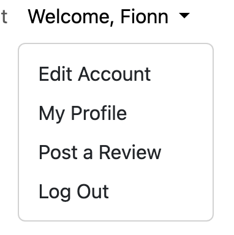

### Footer

- Each page has a footer

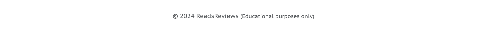

Footer has a copyright text and a disclaimer that says for educational purposes only

### Registration page

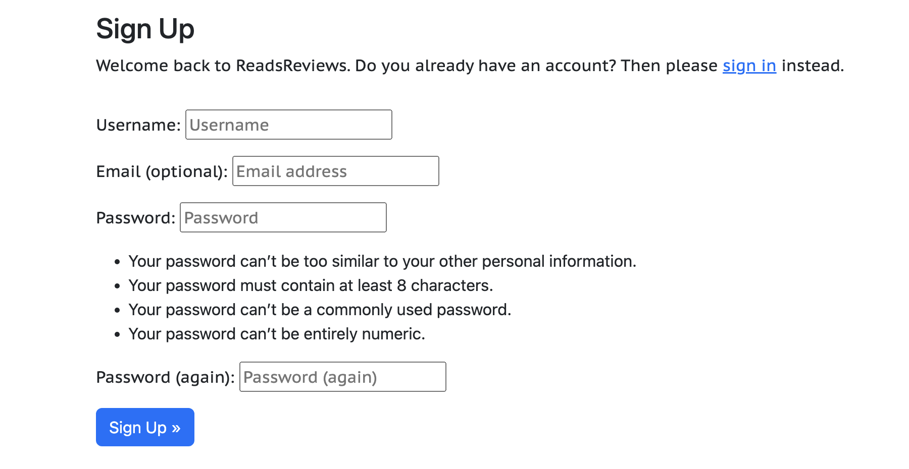

The registration page displays the sign up form. A message pops up saying this field is required if required fields are empty and the sign up button is clicked. It also shows conditions for password creation. If a user already has an account, a sign in link is available to click.

### Log in page

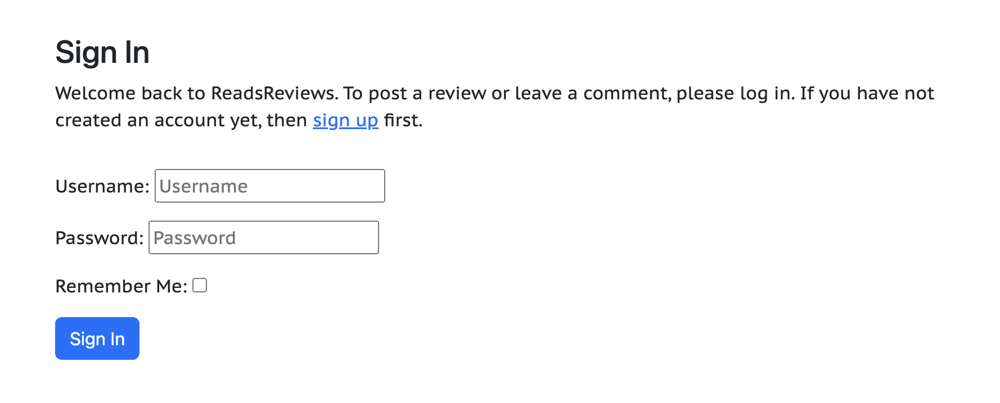

The login page dispays the login form. A message pops up if the username and password are not filled in and the sign in button is pressed. A message also pops up if the wrong password and/or username is entered.

### Log out page

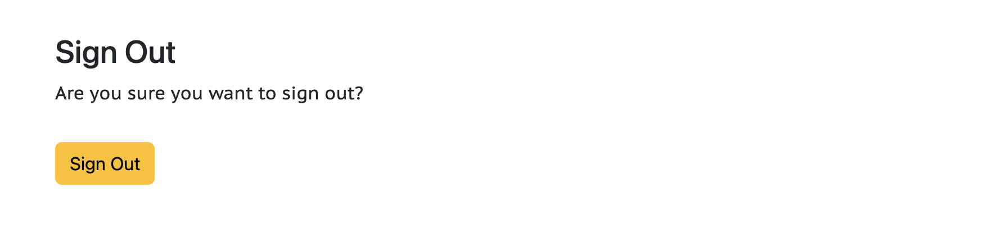

The logout page displays a question that asks the user if they are sure they want to sign out. A sign out button can be clicked to complete the sign out process.

### Home page

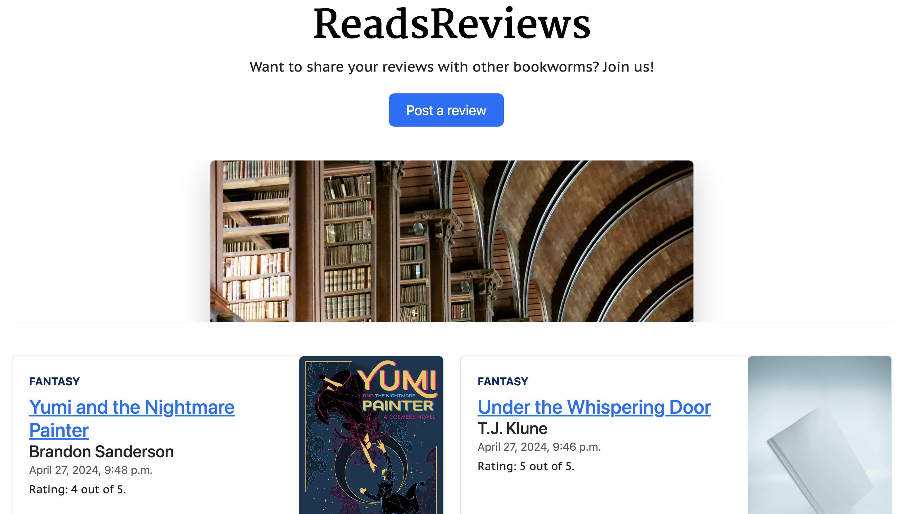

The home page has a hero section that shows the register and log in buttons if a user is not logged in. It shows the post a review button when a user is logged in. Below the hero section, a list of published reviews are displayed.

### About page

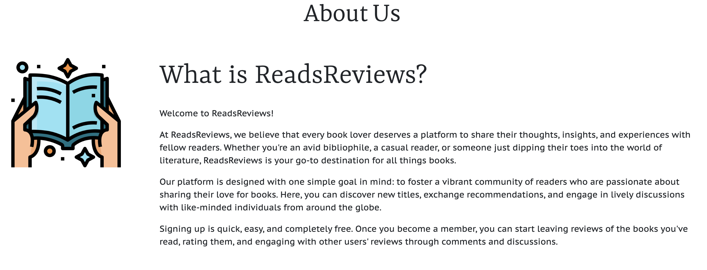

The about page shows what the purposes of the website is.

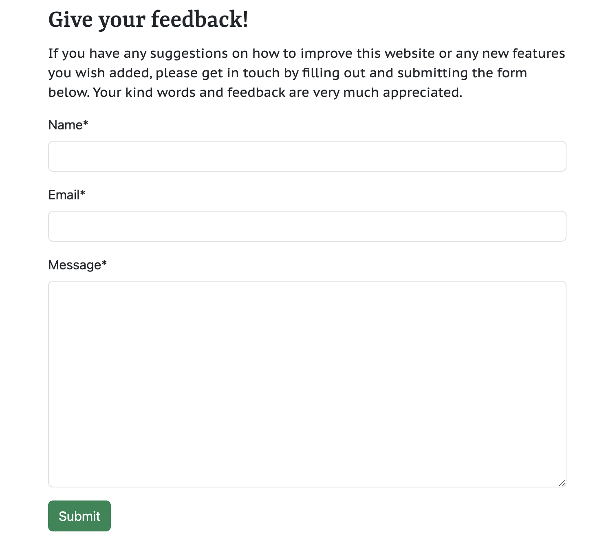

It also has a feedback form that any website visitor can fill out and submite, regardless of whether they are registered or not, logged in or not.

### Profile page

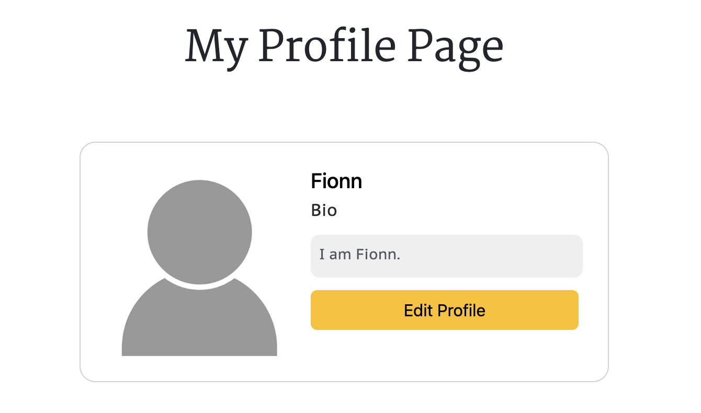

The profile page shows the profile photo, username, and bio. If a user is logged in and viewing their profile page, an edit button can be clicked to edit their profile. The heading also says 'my profile page' if the logged in user is the owner, otherwise it says 'username's profile page'

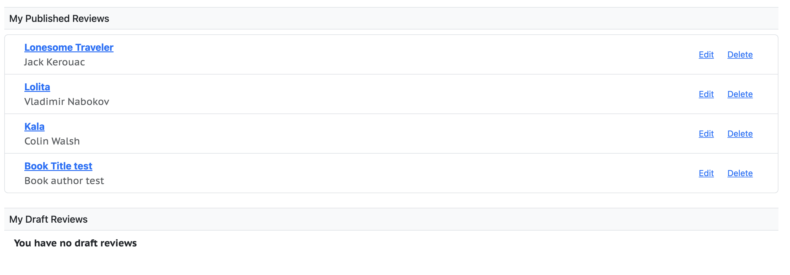

The profile page displays a list of published reviews. It also shows a list of reviews still in draft, if the user logged in is the owner of the profile page. Additionally, the edit button is visible on each published and draft review. Otherwise, if the user logged in is not the owner of the profile page, only a list of published reviews are shown and no drafts, as well as the edit button. The delete button is also available to delete reviews.

### Edit profile page

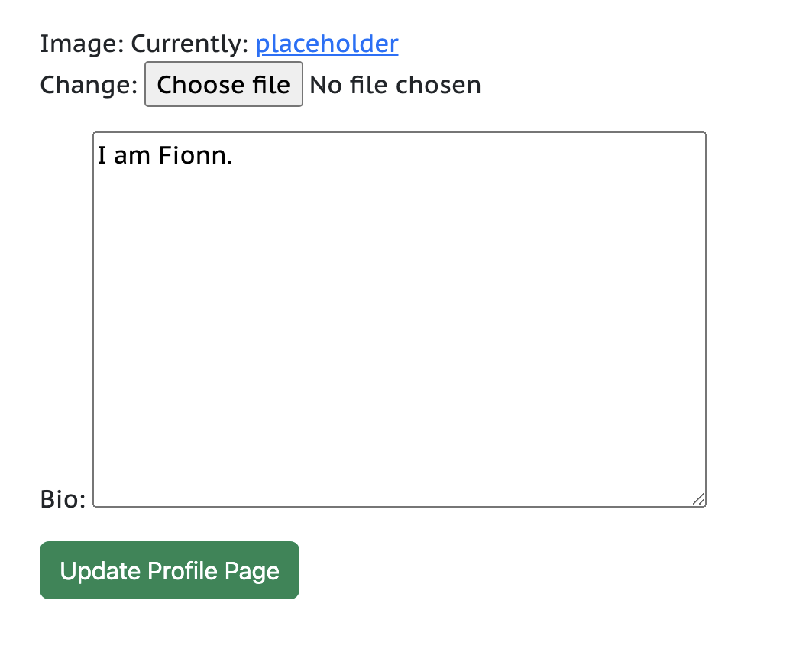

The edit profile page has the functionality to upload a new profile picture and update bio.

### Edit account page

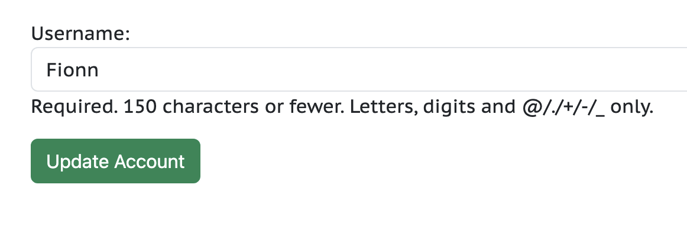

The edit account page has the functionality to update the username.

### Review detail page

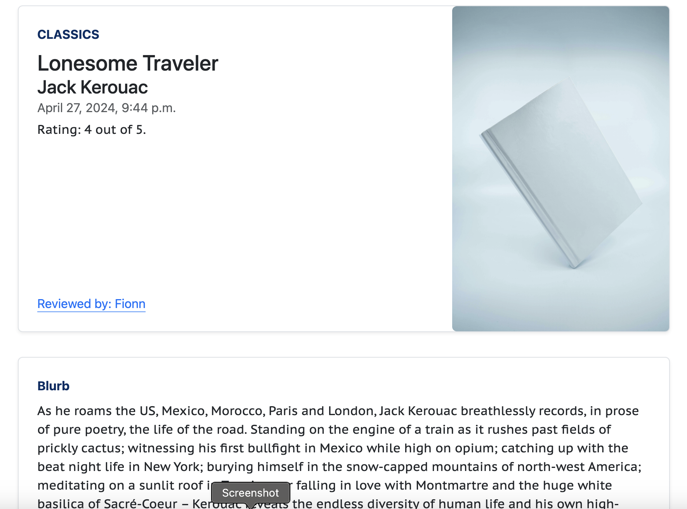
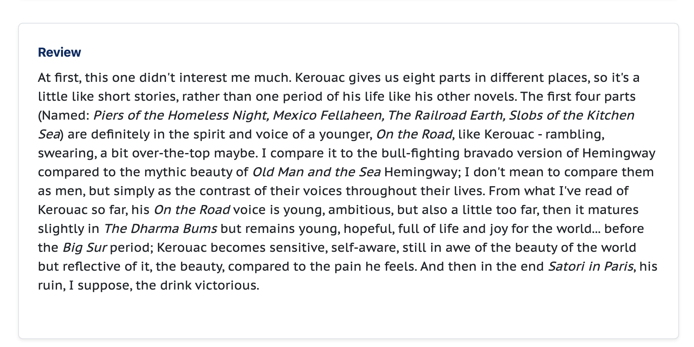

The review detail page shows the book genre, title, author, date of publication, rating, book cover, and the username of the reviewer. It also shows the blurb of the book and the user's review itself.

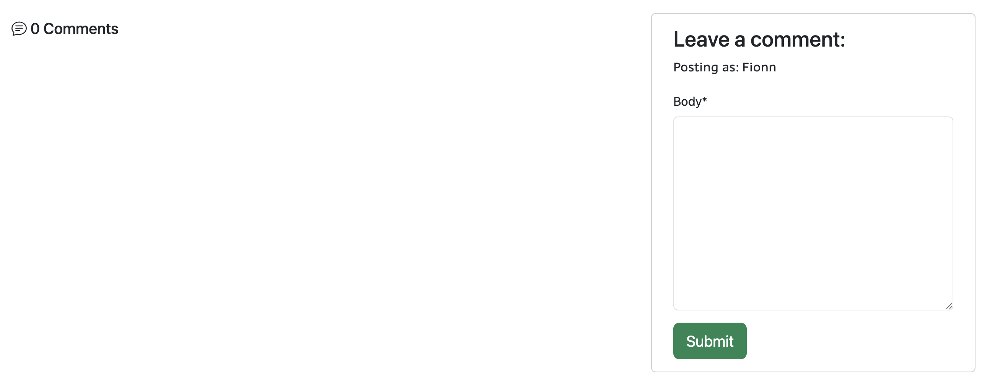

Below the page is the comment section, where a logged in user can leave comments.

### Add review page

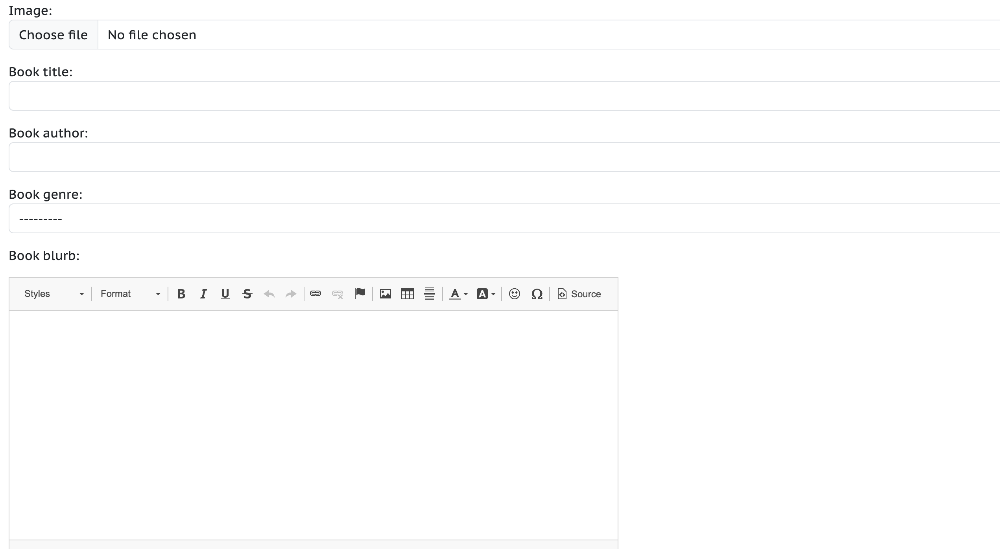
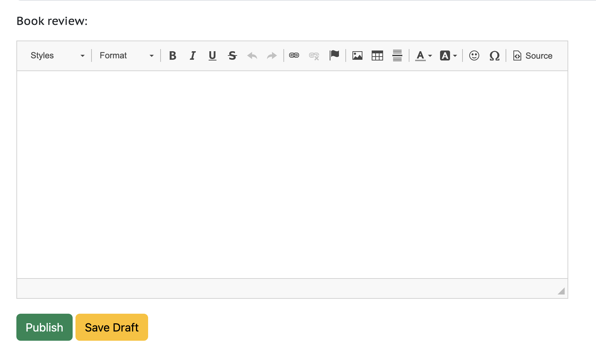

The add review page shows a form that a logged in user can fill out to publish a review of a book. It also have the option to save the review as draft.

### Edit review page

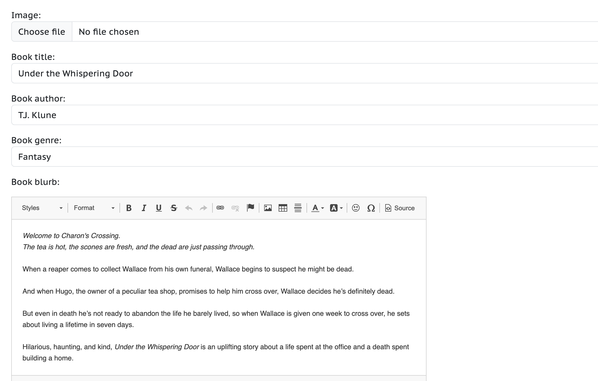
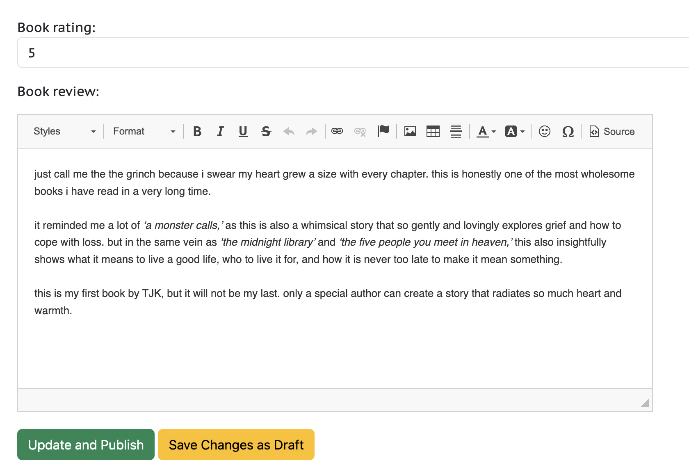

The edit review page shows a prepopulated form to make changes to an existing published review or a review in draft. A button can be clicked to update and publish a previously published review or a review in draft. A button can also be clicked to save changes as draft, which can be applied to a previously published review and makes it as a draft, as well as applied to a draft review and keep it as a draft still.

### Delete review page

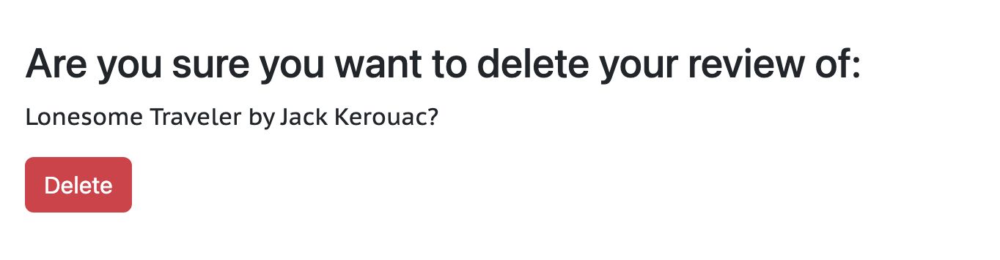

The delete review page asks the user a question of whether they are sure to delete their review. A red delete button can be pressed to confirm deletion.
