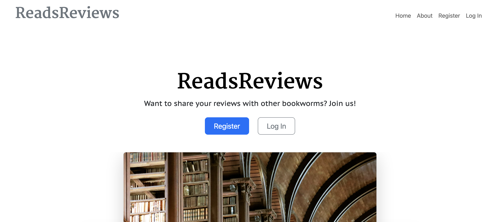
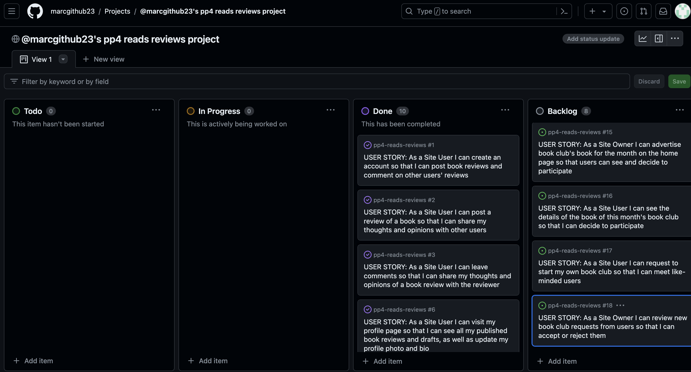
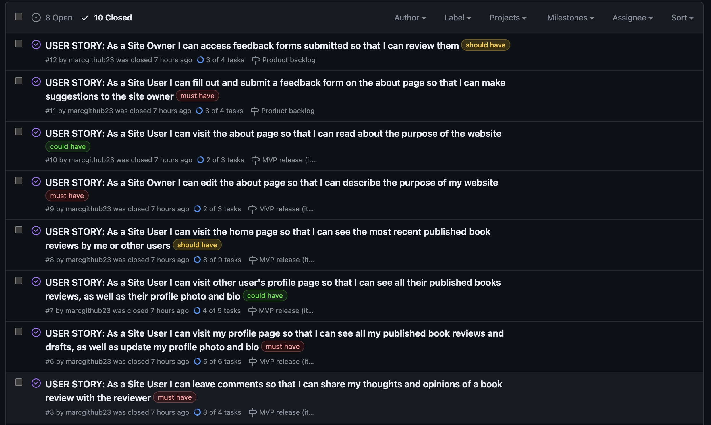
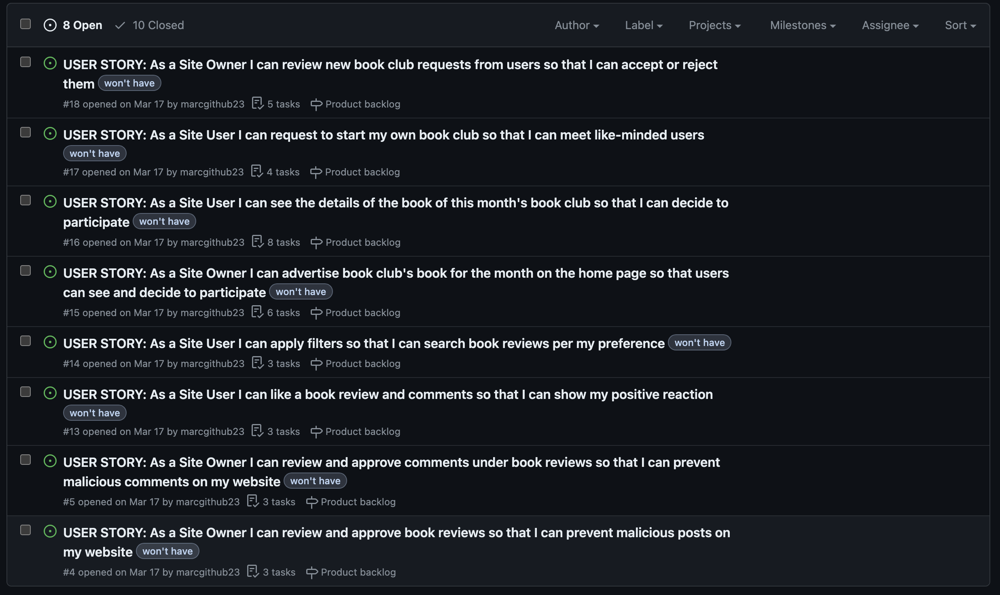

# ReadsReviews



## About

ReadsReviews is a website developed using the Django Framework as the fourth project of my portfolio.

The main purpose of this website is for users to register an account so they can post reviews of books they have read, as well as discuss other users' reviews via comments.

The live website can be accessed here: [ReadsReviews](https://pp4-reads-reviews-6c28ac11e5b9.herokuapp.com/)

## User Experience Design

### Purpose and Target Audience

Developed for book lovers, the app is designed to be easy to use and intuitive. The main goal of the app is to help book lovers meet like-minded people and share their love of reading. This has been achieved by the use of a simple and intuitive interface.

### User Stories

| Issue ID    | User Story |
|-------------|-------------|
|[#1](https://github.com/marcgithub23/pp4-reads-reviews/issues/1)|As a Site User I can create an account so that I can post book reviews and comment on other users' reviews. |
|[#2](https://github.com/marcgithub23/pp4-reads-reviews/issues/2)|As a Site User I can post a review of a book so that I can share my thoughts and opinions with other users.|
|[#3](https://github.com/marcgithub23/pp4-reads-reviews/issues/3)|As a Site User I can leave comments so that I can share my thoughts and opinions of a book review with the reviewer.|
|[#6](https://github.com/marcgithub23/pp4-reads-reviews/issues/6)|As a Site User I can visit my profile page so that I can see all my published book reviews and drafts, as well as update my profile photo and bio.|
|[#7](https://github.com/marcgithub23/pp4-reads-reviews/issues/7)|As a Site User I can visit other user's profile page so that I can see all their published books reviews, as well as their profile photo and bio.|
|[#8](https://github.com/marcgithub23/pp4-reads-reviews/issues/8)|As a Site User I can visit the home page so that I can see the most recent published book reviews by me or other users.|
|[#9](https://github.com/marcgithub23/pp4-reads-reviews/issues/9)|As a Site Owner I can edit the about page so that I can describe the purpose of my website.|
|[#10](https://github.com/marcgithub23/pp4-reads-reviews/issues/10)|As a Site User I can visit the about page so that I can read about the purpose of the website.|
|[#11](https://github.com/marcgithub23/pp4-reads-reviews/issues/11)|As a Site User I can fill out and submit a feedback form on the about page so that I can make suggestions to the site owner.|
|[#12](https://github.com/marcgithub23/pp4-reads-reviews/issues/12)|As a Site Owner I can access feedback forms submitted so that I can review them.|


---


## Agile Methodology

GitHub Project Management was used to manage this project via its kanban board feature.

Link to the [kanban board](https://github.com/users/marcgithub23/projects/2).


[Link](https://github.com/marcgithub23/pp4-reads-reviews/issues?q=is%3Aissue+is%3Aclosed) to the completed and closed user stories.


[Link](https://github.com/marcgithub23/pp4-reads-reviews/issues?q=is%3Aopen+is%3Aissue) to uncompleted and open user stories in the backlog, which will be implemented as future features.



---


## Technologies Used

- ### Languages:
    
    + [Python](https://www.python.org/): the primary language used to develop the server-side of the website.
    + [JS](https://www.javascript.com/): the primary language used to develop interactive components of the website.
    + [HTML](https://developer.mozilla.org/en-US/docs/Web/HTML): the markup language used to create the website.
    + [CSS](https://developer.mozilla.org/en-US/docs/Web/css): the styling language used to style the website.

- ### Frameworks and libraries:

    + [Django](https://www.djangoproject.com/): python framework used to create all the logic.

- ### Databases:

    + [ElephantSQL](https://www.elephantsql.com/): the database used to store all the data.

- ### Other tools:

    + [Git](https://git-scm.com/): the version control system used to manage the code.
    + [Pip3](https://pypi.org/project/pip/): the package manager used to install the dependencies.
    + [Gunicorn](https://gunicorn.org/): the webserver used to run the website.
    + [Spycopg2](https://www.python.org/dev/peps/pep-0249/): the database driver used to connect to the database.
    + [Django-allauth](https://django-allauth.readthedocs.io/en/latest/): the authentication library used to create the user accounts.
    + [Django-crispy-forms](https://django-cryptography.readthedocs.io/en/latest/) was used to control the rendering behavior of Django forms.
    + [Heroku](https://www.heroku.com/): the cloud platform used to host the website.
    + [GitHub](https://github.com/) was used to host the website's source code.
    + [VSCode](https://code.visualstudio.com/): the IDE used to develop the website.
    + [Chrome DevTools](https://developer.chrome.com/docs/devtools/open/) was used to debug the website.
    + [Bootstrap 5](https://getbootstrap.com/) was used for the majority of CSS styling for the website.
    + [Bootstrap Icons](https://icons.getbootstrap.com/) was used for icons used in the website.
    + [Canva](https://www.canva.com/) was used to create wireframes for the website.
    + [LucidChart](https://www.lucidchart.com/) was used to make an ERD to plan the models at the very start of this project.
    + [TinyPNG](https://tinypng.com/) was used to optimise images for the website.
    + [Cloudinary](https://cloudinary.com/) was used to store images in the website.
    + [CKEditor](https://ckeditor.com/) was used to add a rich text editor on the front end.
    + [W3C Validator](https://validator.w3.org/) was used to validate HTML5 code for the website.
    + [W3C CSS validator](https://jigsaw.w3.org/css-validator/) was used to validate CSS code for the website.
    + [JShint](https://jshint.com/) was used to validate JS code for the website.
    + [Code Institute's CI Python Linter](https://pep8ci.herokuapp.com/) was used to validate the PY files.


---


## Features

Please refer to the [FEATURES.md](FEATURES.md) file for all features-related documentation.


---


## Design

The website's design adheres to the principles of Material Design. Emphasizing simplicity of use, all components are crafted for ease of interaction. Employing a minimalistic approach, meaningful design without distraction is delivered. White space enhances user experience and intuitiveness.

### Colour Scheme

The primary colour of the website is white with black as text colour. Grey, blue, green, yellow, and red colours are used for buttons, such as post, submit, edit, update, delete, sign up, log in, and log out. This contributes to a straightforward design and therefore helps users to use and navigate around the website easily.

### Typography

Google Fonts Martel, Yrsa, and PT Sans Caption were used for h1, h2, and p elements respectively. These fonts are consistent with the simplistic and minimalistic design of the website.


### Wireframes

#### Phone devices:

- [Phone home page wireframe](documentation/phone-homepage.png)
- [Phone about page wireframe](documentation/phone-aboutpage.png)
- [Phone profile page wireframe](documentation/phone-profilepage.png)
- [Phone review page wireframe](documentation/phone-reviewpage.png)
- [Phone comments section wireframe](documentation/phone-commentsection.png)

#### Tablet devices:

- [Tablet home page wireframe](documentation/tablet-homepage.png)
- [Tablet about page wireframe](documentation/tablet-aboutpage.png)
- [Tablet profile page wireframe](documentation/tablet-profilepage.png)
- [Tablet review page wireframe](documentation/tablet-reviewpage.png)
- [Tablet comments section wireframe](documentation/tablet-commentsection.png)

#### Laptop or desktop devices:

- [Large screens home page wireframe](documentation/large-homepage.png)
- [Large screens about page wireframe](documentation/large-aboutpage.png)
- [Large screens profile page wireframe](documentation/large-profilepage.png)
- [Large screens review page wireframe](documentation/large-reviewpage.png)
- [Large screens comments section wireframe](documentation/large-commentsection.png)


---


## Information Architecture

### Database

* ElephantSQL was the external database used to store all the data.

### Entity-Relationship Diagram

* [LucidChart](https://www.lucidchart.com/) was used at the inception of data models.

- Then the database schema was generated using the [Django extension pygraphviz](https://django-extensions.readthedocs.io/en/latest/graph_models.html). In this [database schema](documentation/erd-db-schema.png), the five highlighted tables are my models.

### Data Modeling

1. **UserProfile**

Extends Allauth's User model.

| Field Name  | Field Type | Attributes |
| -------------| ------------| --------- |
| user_profile  | OneToOneField  |  User, on_delete cascade |
| profile_photo | CloudinaryField | image, default=placeholder |
| bio  | TextField | blank=True, null=True |

2. **BookReview**

GENRE = Classics, Crime, Fantasy, General Fiction, Horror, Non-fiction, Romance, Science Fiction, Young Adult

BOOK_RATING = 1, 2, 3, 4, 5

STATUS = 0: draft, 1: published

| Field Name  | Field Type | Attributes |
| -------------| ------------| --------- |
| slug  | SlugField  |  max_lenght=200, unique=True |
| book_cover | CloudinaryField | image, default=placeholder |
| book_title  | CharField | max_length=200 |
| book_author  | CharField | max_length=100 |
| book_genre  | CharField | max_length=50, choices=GENRE |
| book_blurb  | RichTextField | n/a |
| book_rating  | IntegerField | choices=BOOK_RATING |
| reviewer  | ForeignKey | User, on_delete cascade |
| book_review  | RichTextField | n/a |
| status  | IntegerField | choices=STATUS, default=0 |
| created_on  | DateTimeField | auto_now_add=True |
| updated_on  | DateTimeField | auto_now=True |

3. **Comment**

| Field Name  | Field Type | Attributes |
| -------------| ------------| --------- |
| book_review  | ForeignKey  |  BookReview, on_delete cascade |
| commenter | ForeignKey | User, on_delete cascade |
| body  | TextField | n/a |
| created_on  | DateTimeField | auto_now_add=True |

4. **About**

| Field Name  | Field Type | Attributes |
| -------------| ------------| --------- |
| title  | CharField  |  max_length=200 |
| updated_on  | DateTimeField | auto_now=True |
| content  | TextField | n/a |

5. **Feedback**

| Field Name  | Field Type | Attributes |
| -------------| ------------| --------- |
| name  | CharField  |  max_length=200 |
| email  | EmailField | n/a |
| message  | TextField | n/a |
| read  | BooleanField | default=False |


---


## Testing

Please refer to the [TESTING.md](TESTING.md) file for all test-related documentation.


## Deployment


This project is deployed on [Heroku](https://www.heroku.com/). Below are the steps taken.
### Setup
#### Prepare your IDE
1. Install dj_database_url and psycopg2
```
pip3 install dj_database_url==0.5.0 psycopg2
```
2. At this point if using Cloudinary you can install now
```
pip3 install dj3-cloudinary-storage
```
3. Create your requirements.txt file
```
pip3 freeze -- local > requirements.txt
```
4. Create your Django project
```
django-admin startproject myprojectname .
```
5. Create your first project app
```
python3 manage.py startapp myappname
```
6. Add your new app to installed apps in your project settings.py
```
INSTALLED_APPS = [
    'django.contrib.admin',
    'django.contrib.auth',
    'django.contrib.contenttypes',
    'django.contrib.sessions',
    'django.contrib.messages',
    'django.contrib.staticfiles',
    'myappname',
]
```
7. Ensure all files are saved
8. Migrate
```
python3 manage.py migrate
```

### Database Setup

1. Visit [ElephantSQL](https://www.elephantsql.com/)
2. Select 'Create New Instance'
3. Give your new plan a name
4. Select the Tiny Turtle (Free) plan - (leave tag fields blank)
5. Select region
6. Review and 'Create Instance'
7. From the dashboard click on your new instance's name
8. Copy the URL

### Deployment
#### Prepare Heroku

1. Visit [Heroku](https://dashboard.heroku.com/apps)
2. Select 'New' and 'Create New App'
3. Name the app
4. Select region and 'Create App'

#### env.py file

1. Create a new file called 'env.py' in the root directory of your project
2. Add the following code:
```
import os

os.environ['DATABASE_URL'] = 'paste_url_from_elephantsql_here'
os.environ['SECRET_KEY'] = 'create_a_secret_key_here'
```

#### settings.py
1. At the top of settings.py just below the Path import, add the following code:
```
import os
import dj_database_url
if os.path.isfile('env.py'):
    import env
```
2. Remove the SECRET_KEY that is in settings and replace with:
```
SECRET_KEY = os.environ.get('SECRET_KEY')
```
3. Comment out the original DATABASES variable and replace with:
```
DATABASES = {
    'default': dj_database_url.parse(os.environ.get('DATABASE_URL'))
}
```
4. Migrate
```
python3 manage.py migrate
```

#### If using Cloudinary
1. Visit [Cloudinary](https://cloudinary.com/) and set up account
2. Copy API environment variable
3. In env.py add:
```
os.environ['CLOUDINARY_URL'] = 'your_cloudinary_api' 
```
4. In settings.py add cloudinary_storage and cloudinary to installed apps
```
INSTALLED_APPS = [
    'django.contrib.admin',
    'django.contrib.auth',
    'django.contrib.contenttypes',
    'django.contrib.sessions',
    'django.contrib.messages',
    'cloudinary_storage',
    'django.contrib.staticfiles',
    'cloudinary',
    'myappname',
]
```
5. Near the end of settings.py add:
```
STATIC_URL = '/static/'
STATICFILES_STORAGE = 'cloudinary_storage.storage.StaticHashedCloudinaryStorage'
STATICFILES_DIRS = [os.path.join(BASE_DIR, 'static')]
STATIC_ROOT = os.path.join(BASE_DIR, 'staticfiles')


MEDIA_URL = '/media/'
DEFAULT_FILE_STORAGE = 'cloudinary_storage.storage.MediaCloudinaryStorage'

```

#### Heroku Config Vars
1. Go to your Heroku Dashboard
2. Go to your app and select 'Settings'
3. Click 'Add config vars'
4. Enter the following:
```
DATABASE_URL : your_elephantsql_url
SECRET_KEY : your_secret_key
PORT: 8000
DISABLE_COLLECTSTATIC : 1
CLOUDINARY_URL : your_cloudinary_url
```

#### Templates
1. In settings.py, find BASE_DIR amd add:
```
TEMPLATES_DIR = os.path.join(BASE_DIR, 'templates')
```
2. Midway down your settings.py file change the DIRS to:
```
[TEMPLATES_DIR]
```

#### Allowed Hosts
1. In settings.py, add to 'Allowed Hosts':
```
'myherokuappname.herokuapp.com',
'localhost'
```

#### Add additional files
1. Create 'templates' and 'static' files
2. Add a Procfile (ensure has an uppercase 'P'), with the following line:
```
web: gunicorn myprojectname.wsgi
```

### Deployment
1. Go to Heroku
2. Open your app and select 'Deploy'
3. Select Github as the deployment method
4. Find the correct repository and connect
5. Deploy Branch

When you deploy it is vital that you do not have DEBUG set to True. To overcome this while simultaneously working in the IDE and being deployed you can:
1. In settings.py replace DEBUG=True with:
```
DEBUG = 'DEBUG' in os.environ
```
2. In your env.py file add:
```
os.environ['DEBUG'] = '1'
```

### Create a Superuser
1. In the terminal of your IDE type the following command:
```
python3 manage.py createsuperuser
```
2. Follow the terminal instructions to set up a password

### Fork

1. Visit [GitHub](https://github.com/) and login/register an account
2. Go to the repository page for [ReadsReviews](https://github.com/marcgithub23/pp4-reads-reviews) - (You can also use the search bar)
3. Select 'Fork' at the top right of the page

### Clone

1. Follow the first 2 steps to Fork
2. Select 'Code' dropdown and choose the clone option your require
3. Copy the command that is created
4. Go to your IDE and in the terminal and paste the command
5. To install the packages needed input the following code in the terminal:
```
pip3 install -r requirements/txt
```

## Credits

### Coding

- This project was inspired by the following Django tutorials:
    - Django Blog walkthrough tutorial by [Code Institute](https://codeinstitute.net/)
    - [Create a Simple Django Blog](https://youtube.com/playlist?list=PLCC34OHNcOtr025c1kHSPrnP18YPB-NFi&si=nC4kLnoe3KxXPus1) by [Codemy](https://www.youtube.com/@Codemycom)
    - [Python Django Tutorial for Beginners](https://youtube.com/playlist?list=PL0Zuz27SZ-6NamGNr7dEqzNFEcZ_FAUVX&si=JgpwOiNdsu7mpkno) by [Dave Gray](https://www.youtube.com/@DaveGrayTeachesCode)
- For prepopulating the slug field using slugify in a Django form, this [stackoverflow thread](https://stackoverflow.com/questions/55314246/pre-populate-slug-field-into-a-form-field-of-a-django-site) was consulted.
- For defensive mechanism against unauthorised access, this [stackoverflow thread](https://stackoverflow.com/questions/40894567/django-updateview-dispatch-reduce-the-number-of-queries) was consulted.
- For implementing signals and receivers for automating profile creation when a user registers and linking both, my mentor [Juliia Konovalova](https://github.com/IuliiaKonovalova) showed me how using her own code as an example.
- For using the Django extension pygraphviz, this [article](https://yathomasi.medium.com/1-using-django-extensions-to-visualize-the-database-diagram-in-django-application-c5fa7e710e16) was consulted.
- For styling the website, the following resources were consulted:
    - [Bootstrap 5 examples](https://getbootstrap.com/docs/5.3/examples/)
    - This [article](https://realpython.com/django-pagination/#djangos-built-in-paginator) for the pagination
    - This [webpage](https://mdbootstrap.com/docs/standard/extended/comments/) for the comments section
    - This [webpage](https://mdbootstrap.com/docs/standard/extended/profiles/) for the profile page
    - This [webpage](https://mdbootstrap.com/docs/standard/components/list-group/) for displaying reviews as list on the profile page

### Images

- The hero image is by [Jonathan Singer](https://unsplash.com/@jbsinger1970?utm_content=creditCopyText&utm_medium=referral&utm_source=unsplash) on [Unsplash](https://unsplash.com/photos/library-interioe-NgU7IJ5XuyY?utm_content=creditCopyText&utm_medium=referral&utm_source=unsplash).
- The image used for default book cover is by [Medamodifier](https://unsplash.com/@mediamodifier?utm_content=creditCopyText&utm_medium=referral&utm_source=unsplash) on [Unsplash](https://unsplash.com/photos/white-paper-on-white-surface-pSay3DJpVEY?utm_content=creditCopyText&utm_medium=referral&utm_source=unsplash)
- Any other book cover images used are from [Goodreads](https://www.goodreads.com/).
- The image used for default profile photo is from the Django walkthrough by [Code Institute](https://codeinstitute.net/)
- The title icon is from [Flaticon](https://www.flaticon.com/free-icons/reading).
- Favicon was generated from [favicon](https://favicon.io/).
- [Fontjoy](https://fontjoy.com/) was used to find font pairings.