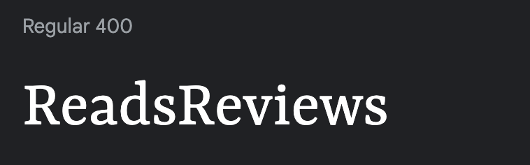

# ReadsReviews

## About

ReadsReviews is a website developed using the Django Framework as the fourth project of my portfolio.

The main purpose of this website is for users to register an account so they can post reviews of books they have read, as well as discuss other users' reviews via comments.

The live website can be accessed here: [ReadsReviews](https://pp4-reads-reviews-6c28ac11e5b9.herokuapp.com/)

## User Experience Design

### Purpose and Target Audience

Developed for book lovers, the app is designed to be easy to use and intuitive. The main goal of the app is to help book lovers meet like-minded people and share their love of reading. This has been achieved by the use of a simple and intuitive interface.

### User Stories

| Issue ID    | User Story |
|-------------|-------------|
|[#1](https://github.com/marcgithub23/pp4-reads-reviews/issues/1)|As a Site User I can create an account so that I can post book reviews and comment on other users' reviews. |
|[#2](https://github.com/marcgithub23/pp4-reads-reviews/issues/2)|As a Site User I can post a review of a book so that I can share my thoughts and opinions with other users.|
|[#3](https://github.com/marcgithub23/pp4-reads-reviews/issues/3)|As a Site User I can leave comments so that I can share my thoughts and opinions of a book review with the reviewer.|
|[#6](https://github.com/marcgithub23/pp4-reads-reviews/issues/6)|As a Site User I can visit my profile page so that I can see all my published book reviews and drafts, as well as update my profile photo and bio.|
|[#7](https://github.com/marcgithub23/pp4-reads-reviews/issues/7)|As a Site User I can visit other user's profile page so that I can see all their published books reviews, as well as their profile photo and bio.|
|[#8](https://github.com/marcgithub23/pp4-reads-reviews/issues/8)|As a Site User I can visit the home page so that I can see the most recent published book reviews by me or other users.|
|[#9](https://github.com/marcgithub23/pp4-reads-reviews/issues/9)|As a Site Owner I can edit the about page so that I can describe the purpose of my website.|
|[#10](https://github.com/marcgithub23/pp4-reads-reviews/issues/10)|As a Site User I can visit the about page so that I can read about the purpose of the website.|
|[#11](https://github.com/marcgithub23/pp4-reads-reviews/issues/11)|As a Site User I can fill out and submit a feedback form on the about page so that I can make suggestions to the site owner.|
|[#12](https://github.com/marcgithub23/pp4-reads-reviews/issues/12)|As a Site Owner I can access feedback forms submitted so that I can review them.|

---

## Technologies Used

- ### Languages:
    
    + [Python](https://www.python.org/): the primary language used to develop the server-side of the website.
    + [JS](https://www.javascript.com/): the primary language used to develop interactive components of the website.
    + [HTML](https://developer.mozilla.org/en-US/docs/Web/HTML): the markup language used to create the website.
    + [CSS](https://developer.mozilla.org/en-US/docs/Web/css): the styling language used to style the website.

- ### Frameworks and libraries:

    + [Django](https://www.djangoproject.com/): python framework used to create all the logic.

- ### Databases:

    + [ElephantSQL](https://www.elephantsql.com/): the database used to store all the data.

- ### Other tools:

    + [Git](https://git-scm.com/): the version control system used to manage the code.
    + [Pip3](https://pypi.org/project/pip/): the package manager used to install the dependencies.
    + [Gunicorn](https://gunicorn.org/): the webserver used to run the website.
    + [Spycopg2](https://www.python.org/dev/peps/pep-0249/): the database driver used to connect to the database.
    + [Django-allauth](https://django-allauth.readthedocs.io/en/latest/): the authentication library used to create the user accounts.
    + [Django-crispy-forms](https://django-cryptography.readthedocs.io/en/latest/) was used to control the rendering behavior of Django forms.
    + [Heroku](https://www.heroku.com/): the cloud platform used to host the website.
    + [GitHub](https://github.com/) was used to host the website's source code.
    + [VSCode](https://code.visualstudio.com/): the IDE used to develop the website.
    + [Chrome DevTools](https://developer.chrome.com/docs/devtools/open/) was used to debug the website.
    + [Bootstrap 5](https://getbootstrap.com/) was used for the majority of CSS styling for the website.
    + [Bootstrap Icons](https://icons.getbootstrap.com/) was used for icons used in the website.
    + [LucidChart](https://www.lucidchart.com/) was used to make an ERD to plan the models at the very start of this project.
    + [TinyPNG](https://tinypng.com/) was used to optimise images for the website.
    + [W3C Validator](https://validator.w3.org/) was used to validate HTML5 code for the website.
    + [W3C CSS validator](https://jigsaw.w3.org/css-validator/) was used to validate CSS code for the website.
    + [JShint](https://jshint.com/) was used to validate JS code for the website.
    + [Code Institute's CI Python Linter](https://pep8ci.herokuapp.com/) was used to validate the PY files.

---

## Design

The website's design adheres to the principles of Material Design. Emphasizing simplicity of use, all components are crafted for ease of interaction. Employing a minimalistic approach, meaningful design without distraction is delivered. White space enhances user experience and intuitiveness.

### Colour Scheme

The primary colour of the website is white with black as text colour. Grey, blue, green, yellow, and red colours are used for buttons, such as post, submit, edit, update, delete, sign up, log in, and log out. This contributes to a straightforward design and therefore helps users to use and navigate around the website easily.

### Typography

Google Fonts Martel, Yrsa, and PT Sans Caption were used for h1, h2, and p elements respectively. These fonts are consistent with the simplistic and minimalistic design of the website.

### Wireframes

#### Phone devices:

- [Phone home page wireframe](documentation/phone-homepage.png)
- [Phone about page wireframe](documentation/phone-aboutpage.png)
- [Phone profile page wireframe](documentation/phone-profilepage.png)
- [Phone review page wireframe](documentation/phone-reviewpage.png)
- [Phone comments section wireframe](documentation/phone-commentsection.png)

#### Tablet devices:

- [Tablet home page wireframe](documentation/tablet-homepage.png)
- [Tablet about page wireframe](documentation/tablet-aboutpage.png)
- [Tablet profile page wireframe](documentation/tablet-profilepage.png)
- [Tablet review page wireframe](documentation/tablet-reviewpage.png)
- [Tablet comments section wireframe](documentation/tablet-commentsection.png)

#### Laptop or desktop devices:

- [Large screens home page wireframe](documentation/large-homepage.png)
- [Large screens about page wireframe](documentation/large-aboutpage.png)
- [Large screens profile page wireframe](documentation/large-profilepage.png)
- [Large screens review page wireframe](documentation/large-reviewpage.png)
- [Large screens comments section wireframe](documentation/large-commentsection.png)

---

## Information Architecture

### Database

* ElephantSQL was the external database used to store all the data.

### Entity-Relationship Diagram

* [LucidChart](https://www.lucidchart.com/) was used at the inception of data models.

- Then the database schema was generated using the [Django extension pygraphviz](https://django-extensions.readthedocs.io/en/latest/graph_models.html). In this [database schema](documentation/erd-db-schema.png), the five highlighted tables are my models.

### Data Modeling

1. **UserProfile**

Extends Allauth's User model.

| Field Name  | Field Type | Attributes |
| -------------| ------------| --------- |
| user_profile  | OneToOneField  |  User, on_delete cascade |
| profile_photo | CloudinaryField | image, default=placeholder |
| bio  | TextField | blank=True, null=True |

2. **BookReview**

GENRE = Classics, Crime, Fantasy, General Fiction, Horror, Non-fiction, Romance, Science Fiction, Young Adult

BOOK_RATING = 1, 2, 3, 4, 5

STATUS = 0: draft, 1: published

| Field Name  | Field Type | Attributes |
| -------------| ------------| --------- |
| slug  | SlugField  |  max_lenght=200, unique=True |
| book_cover | CloudinaryField | image, default=placeholder |
| book_title  | CharField | max_length=200 |
| book_author  | CharField | max_length=100 |
| book_genre  | CharField | max_length=50, choices=GENRE |
| book_blurb  | RichTextField | n/a |
| book_rating  | IntegerField | choices=BOOK_RATING |
| reviewer  | ForeignKey | User, on_delete cascade |
| book_review  | RichTextField | n/a |
| status  | IntegerField | choices=STATUS, default=0 |
| created_on  | DateTimeField | auto_now_add=True |
| updated_on  | DateTimeField | auto_now=True |

3. **Comment**

| Field Name  | Field Type | Attributes |
| -------------| ------------| --------- |
| book_review  | ForeignKey  |  BookReview, on_delete cascade |
| commenter | ForeignKey | User, on_delete cascade |
| body  | TextField | n/a |
| created_on  | DateTimeField | auto_now_add=True |

4. **About**

| Field Name  | Field Type | Attributes |
| -------------| ------------| --------- |
| title  | CharField  |  max_length=200 |
| updated_on  | DateTimeField | auto_now=True |
| content  | TextField | n/a |

5. **Feedback**

| Field Name  | Field Type | Attributes |
| -------------| ------------| --------- |
| name  | CharField  |  max_length=200 |
| email  | EmailField | n/a |
| message  | TextField | n/a |
| read  | BooleanField | default=False |
