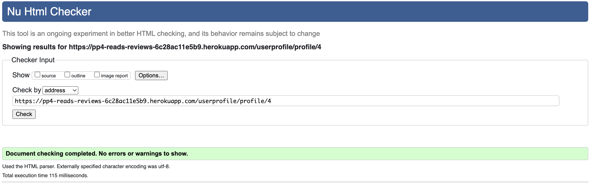
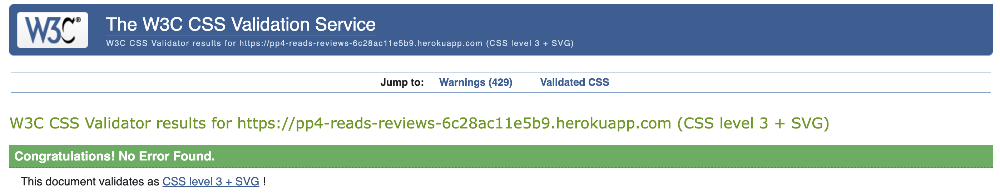
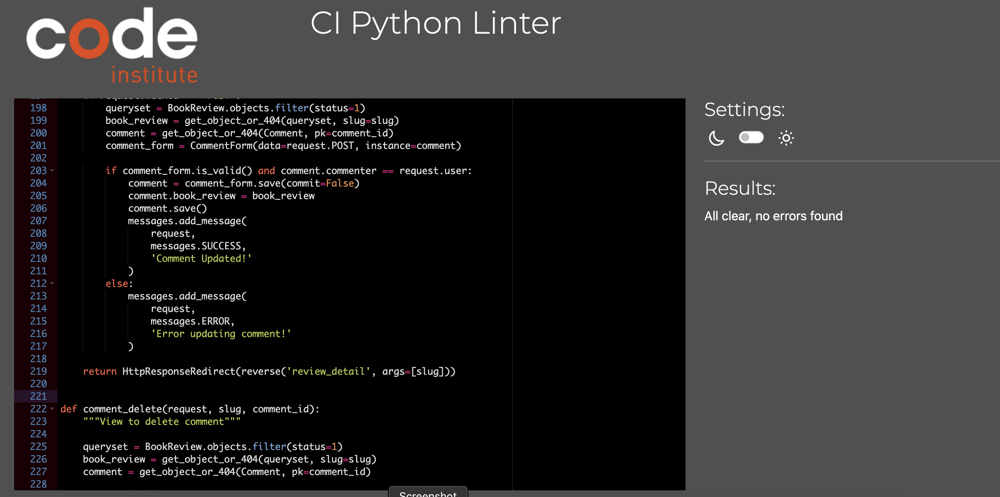
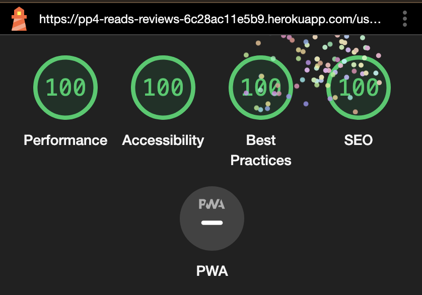

# Testing

## Manual Testing

Usability was tested with the below user acceptance testing.

|     | User Actions   | Expected Results | Y/N | Comments  |
|-------------|------------------------|------------------|------|-------------|
| Sign Up     |                        |                  |      |             |
| 1           | Click on register button | Bring up registraion page | Y |   Register button both on navbar and hero  |
| 2           | Click on log in link in the form | Bring up login page | Y |  n/a  |
| 3           | Wrong input | Message shows error | Y |  n/a  |
| 4           | Click sign up button | Redirect to homepage with confirmation message | Y |  n/a  |
| Log In     |                        |                  |      |             |
| 1           | Click on login button | Bring up login page | Y |   Login button both on navbar and hero  |
| 2           | Click on sign up link in the form | Bring up registration page | Y |  n/a  |
| 3           | Wrong input | Message shows wrong username or password | Y |  n/a  |
| 4           | Click sign in button | Redirect to homepage with confirmation message | Y |  n/a  |
| Log Out     |                        |                  |      |             |
| 1           | Click on logout button | Bring up logout page | Y |   Logout button on navbar dropdown menu  |
| 2           | Confirm and click on sign out button | Redirect to homepage with confirmation message | Y |   n/a  |
| Account     |                        |                  |      |             |
| 1           | Click on edit account under dropdown menu on navbar | Bring up account edit form | Y |   n/a  |
| 2           | Click on update account button | Changes username, redirect to homepage with confirmation message | Y |   n/a  |
| Profile     |                        |                  |      |             |
| 1           | Click on my profile under dropdown menu on navbar | Bring up profile page | Y |   This can also be accessed via username link in a review   |
| 2           | Click on edit profile button | Bring edit profile page form | Y |   n/a  |
| 3           | Click on edit review button | Bring edit review page form | Y |   n/a  |
| 4           | Click on delete review button | Bring delete review page | Y |   n/a  |
| Home Page     |                        |                  |      |             |
| 1           | Click on logo brand | Bring up home page | Y |   Logo brand on navbar   |
| 2           | Click on home navbar link | Bring up home page | Y |   n/a   |
| 3           | Click on post a review button | Bring up add a review page | Y |  Button located in hero section and navbar dropdown menu   |
| 4           | Click on a book title in a review | Bring up review detail page | Y |  n/a   |
| 5           | Click on a username in a review | Bring up profile page of that user | Y |  n/a   |
| 6           | Click on next page button | Bring up next page of reviews | Y |  Not shown if on last page   |
| 7           | Click on last page button | Bring up last page of reviews | Y |  Not shown if on last page   |
| 8           | Click on previous page button | Bring up previous page of reviews | Y |  Not shown if on first page   |
| 9           | Click on first page button | Bring up first page of reviews | Y |  Not shown if on first page   |
| About Page     |                        |                  |      |             |
| 1           | Click on about link on navbar | Bring up about page | Y |  n/a   |
| 2           | Fill out and submit feedback form | Show confirmation message | Y |  n/a   |
| Review     |                        |                  |      |             |
| 1           | Click on post a review button | Bring up add a review page | Y |  Button located in hero section and navbar dropdown menu   |
| 2           | Wrong input | Message shows error | N |  Validation message doesn't show up, but required field is highlighted  |
| 3           | Click publish | Redirect to home page with confirmation message | Y |  n/a  |
| 4           | Click save draft | Redirect to home page with confirmation message | Y |  n/a  |
| 5           | Edit published or draft review | Bring up edit review page | Y |  n/a  |
| 6           | Click update and publish | Redirect to home page with confirmation message | Y |  n/a  |
| 7           | Click save changes as draft | Redirect to home page with confirmation message | Y |  A previously published review can be unpublished and put in draft  |
| 8           | Delete published or draft review | Bring up delete review page | Y |  n/a  |
| 9           | Confirm and click delete button | Redirect to home page with confirmation message | Y |  n/a  |
| 10           | Leave a comment | Comment shows up in comment section | Y |  Confirmation message shows  |
| 11           | Edit comment | Comment is edited | Y |  Confirmation message shows  |
| 12           | Delete comment | Comment is deleted | Y |  Modal window to confirm deletion and confirmation message shows when delete button is clicked for the second time  |

---

## Testing User Story

| User Goals | Requirement met |
| ------------------------- | --------------- |
| As a Site User I can create an account so that I can post book reviews and comment on other users' reviews. | Y |
| As a Site User I can post a review of a book so that I can share my thoughts and opinions with other users. | Y |
| As a Site User I can leave comments so that I can share my thoughts and opinions of a book review with the reviewer. | Y |
| As a Site User I can visit my profile page so that I can see all my published book reviews and drafts, as well as update my profile photo and bio. | Y |
| As a Site User I can visit other user's profile page so that I can see all their published books reviews, as well as their profile photo and bio. | Y |
| As a Site User I can visit the home page so that I can see the most recent published book reviews by me or other users. | Y |
| As a Site Owner I can edit the about page so that I can describe the purpose of my website. | Y |
| As a Site User I can fill out and submit a feedback form on the about page so that I can make suggestions to the site owner. | Y |
| As a Site Owner I can access feedback forms submitted so that I can review them. | Y |

---

## Testing Defensive Mechanism

Defensive coding has been applied for the CRUD functionalities of the website to prevent unauthorised access or actions, especially via typing url links manually. In addition to using LoginRequiredMixin in class based views and defining the dispatch method, DTL if conditions are also employed in the corresponding HTML templates.

---

## Validation

### HTML Validation:

When using the official [W3C](https://validator.w3.org/) validator, summernote rich text editor causes a stray closing p tag triggering errors.

#### Homepage
- 
- 

#### About page
- 

#### Book detail page
- 

#### Profile page
- 

#### Add review page
- 

#### Edit review page
- 

#### Delete review page
- 

#### Edit account page
- 

#### Edit profile page
- 

### CSS Validation:

- 

### Python Validation:

#### About app

- 
- 
- 
- 
- 

#### Review app

- 
- 
- 
- 
- 

### Userprofile app

- 
- 
- 
- 
- 
- 

### Root/top level

- 

### ReadsReviews main app

The key value pair is too long to be truncated in less than 80 characters in one line.

- 
- 

---

## Lighthouse Report

### Registration page

- 

### Login page

- 

### Logout page

- 

### Home page

- 

### About page

- 

### Review detail page

- 

### Profile page

- 

### Edit account page

- 

### Edit profile page

- 

### Add a review page

- 

### Edit a review page

- 

### Delete a review page

- 

---

## Responsiveness

Bootstrap 5 was used for the majority of styling and designing the layout and display of the website, which is a responsive mobile first design. The responsiveness was checked manually by using devtools (Chrome) throughout the whole development.

---

## Bugs

### Known bugs

When adding a new review and the wrong input is entered or a required field is left empty, there is no informative warning message and the field is only highlighted in blue. While this remains unfixed, possible solutions could be custom CSS form validation.

